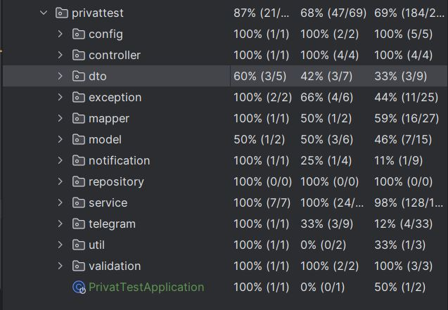

# API курсу валют

<p align="center">
  <a href="#introduction">Introduction</a> ♦
<a href="#getting-started">Getting started</a> ♦
<a href="#features">Additional features</a> ♦
<a href="#controllers">Endpoints</a> ♦
<a href="#tests">Testing</a>
</p>

<h2 id="introduction"> Introduction</h2>
API на основі Java для відстеження курсів валют ПриватБанку та Монобанку. 
API розраховує середні обмінні курси для доларів США (код 840) і євро (код 978), зберігає їх у базі даних і надає функції для отримання останніх записів, погодинних різниць і щоденної динаміки.
При оновленні даних API шле повідомлення у бот всім підключеним користувачам

__Якщо даних нема - повертається так само статус 200, а не 404, адже це нормальна поведінка для такого додатку, і це не помилка користувача__

<h2 id="features"> Additional features</h2>
З додаткових технологій хочу зазначити що я використовував:

- Swagger API: Для документації API, за посиланням: `/swagger-ui/index.html#/`
- Liquibase: Для контролю версій бази даних
- CheckStyle плагін: Для контролю написання чистого коду в одному стилі
- TestContainers: Для спрощення тестування додатку, що взаємодіє з зовнішніми залежностіми, такими як бази даних 

<h2 id="getting-started"> Getting started</h2>

1. Зклонуй проект
```text
git clone https://github.com/Oleksandr-Tymoshenko/privat-test-currency.git
```
2. Створи `.env` файл в головінй директорії проекта і заповни змінними. 
Приклад змінних у `.env.sample` файлі.
3. Створи тільки базу даних і запиши її ім'я в `.env` файл. 
Всі таблиці створяться самі за допомогою міграцій 
4. Телеграм бот за посиланням
```text
https://t.me/privat_testtask_exchange_bot
```

<h2 id="controllers"> Endpoints</h2>

| **HTTP method** |             **Endpoint**             | **Function**                                                                                                                                       |
|:---------------:|:------------------------------------:|:---------------------------------------------------------------------------------------------------------------------------------------------------|
|       GET       |      /api/exchange-rate/latest       | Вихідні дані: останній запис з БД або відповідне повідомлення про помилку                                                                          |
|       GET       | /api/exchange-rate/hourly-difference | Вихідні дані: об’єкт з різницею курсу останнього запису відносно попередньої години у відсотках або повідомлення про помилку                       |
|       GET       |  /api/exchange-rate/daily-dynamics   | Вихідні дані: список об’єктів з різницею курсу кожного запису від початку дня відносно попередньої години у відсотках або повідомлення про помилку |

<h2 id="tests"> Testing</h2>
Покриття тестами:


